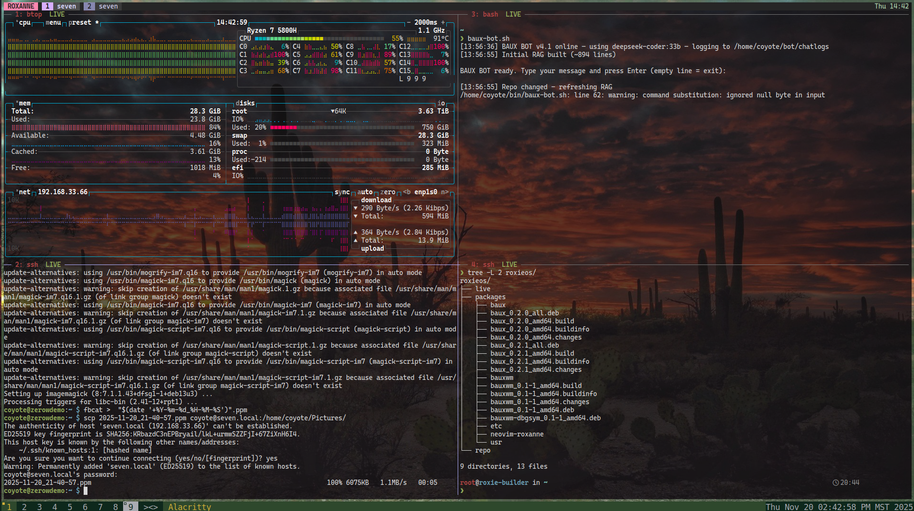
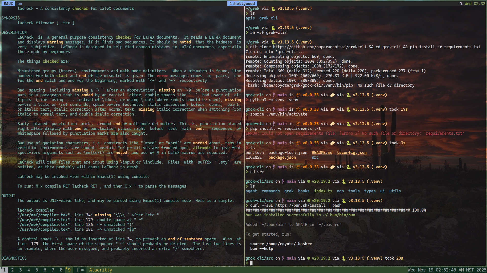
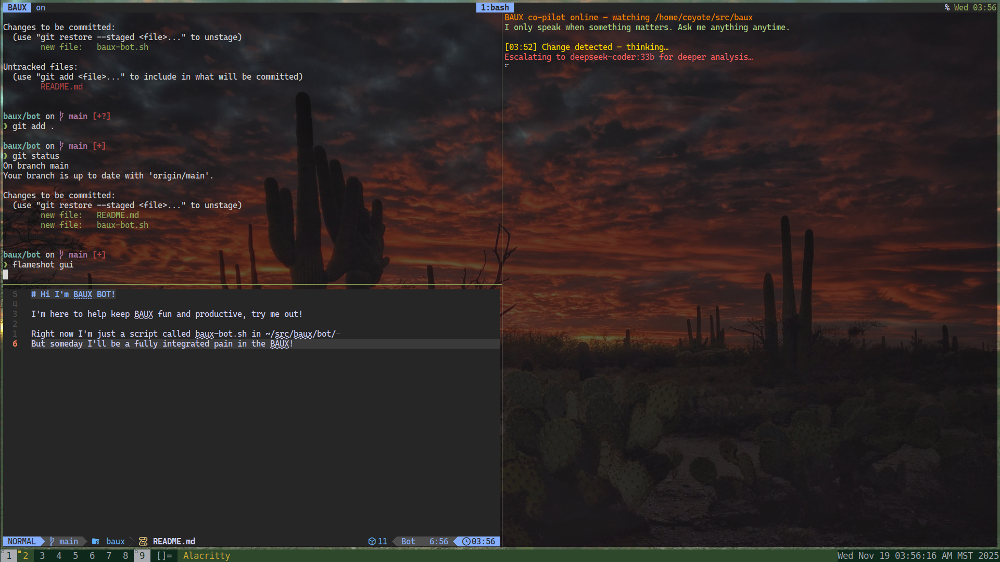

# BAUX • RoxieOS  
### Terminal-Native Distributed Development Environment for Embedded Systems

### Live Status (2025-11-19)
- ✅ Core tmux + Neovim + auto-reconnect loop working
- ✅ Core tmux + Neovim + auto-reconnect on Raspberry Pi Zero W
- ✅ baux-bot v4 running deepseek-coder:33b on remote Ryzen host
- ✅ Real-time RAG refresh on every git push for bot
- ✅ Host/client role detection → nesting tmux issue fixed?
- 🔧 Building next .deb from inside baux-bot session right now with scripts
- 🔧 HOST specific "session" auto-reconnect SSH/SQL/TTY-USB whatever automagic
- 🔜 leader-B hotkey + systemd auto-start
- 🔜 RoxieOS container builds reproducible

    
    

***WARNING***
 BAUX is meant for dedicated hardware. It will break your existing system and overwrite required critical data.
 BAUX itself is not yet stable, and a work in progress. HIGH RISK damage to data and hardware is not only possible, but likely at this state.
 Mind blower? To run you must install BAUX on two systems (hardware or virtual), dedicated, running RoxieOS or it won't really even make sense enough to learn it. At least test it in a container, don't install it on anything you care about. It's "just a configuration script, that thinks it's an OS" but it will nuke your existing OS, sometimes, randomly.

**BAUX** is a next-generation, terminal-native development environment designed for **embedded systems**, **remote hardware debugging**, and **multi-host SSH workflows**—built to run smoothly even on a **Raspberry Pi Zero**.

It provides a **persistent, distributed, session-aware interface** that merges:

- **Neovim** (IDE, UI, scripting engine)  
- **tmux** (process/session multiplexer)  
- **Lua** (BAUX’s configuration & automation language)  

…into a unified environment that behaves like a **terminal-based distributed operating system**.

**RoxieOS** is a micro-Debian distribution optimized for BAUX.

Together, they form a cohesive ecosystem for hardware-focused developers.

---

# 1. What Is BAUX?

### **BAUX is a Terminal-Based Distributed Multiplexing IDE**

A tighter definition:

> **BAUX is a host-aware, persistent, auto-reconnecting, Neovim-powered shell environment built on top of tmux, designed to orchestrate development workflows across many devices simultaneously.**

Think of BAUX as a highly opinionated session multiplexer, a "meta-OS for terminal life," a "non-X, non-Wayland" way of life, "the Omarchy of life in a shell."

The emphasis is on **distributed session management**:

- Each host (local or remote) has its own BAUX “layout”
- tmux layouts auto-load and auto-save
- SSH panes reconnect automatically
- No nested tmux issues (per-host namespaces)
- Neovim acts as the main UI framework
- The entire environment survives:
  - network drop  
  - power loss  
  - device crash  
  - laptop sleep/roam  

BAUX is **cross-platform**  
(Linux, macOS, BSD, containers, Raspberry Pi, servers).

It is designed especially for **embedded developers** working with:

- microcontrollers  
- SBCs  
- robotics  
- sensors  
- 3D printers  
- field-deployed data collection units  

---

# 2. Why BAUX Exists

Embedded + distributed development today is built on **fragile glue**:

- SSH sessions that get disconnected  
- tmux sessions that get nested  
- ad-hoc Neovim configs lacking workflow cohesion  
- separate terminals for build servers, microcontrollers, logs, and SQL DBs  
- remote/field hardware waking up and going offline unpredictably  

BAUX consolidates all these scattered pieces into a **single structured environment**.

### BAUX solves four critical problems:

#### **1. Persistent, Distributed Workflows**
Automatically reconnect SSH panes and restore all session state—even across multiple hosts.

#### **2. A True IDE Inside the Terminal**
Neovim handles:
- LSP
- debugging (DAP)
- file navigation
- serial monitors
- hardware dashboards
- build & upload workflows

#### **3. Runs on the Slowest Hardware**
The **Raspberry Pi Zero (non-W)** is the target baseline.

#### **4. Reproducibility**
Containers and Debian packages ensure identical environments everywhere.

---

# 3. The BAUX Ecosystem

There are **two tightly-related projects**:

---

## BAUX  
### The Shell Environment & Core Technology  
(Primary focus of v0.1)

Features:

- **Neovim-based UI** (Lua-driven)
- **tmux layout engine**
- **distributed session manager**
- **per-host layout namespaces**
- **auto-reconnect SSH integration**
- **static builds** for Pi Zero
- **minimal plugin set** for low memory systems

BAUX is the heart of the system.

---

## RoxieOS  
### Micro-Debian Distribution Optimized for BAUX

Think of RoxieOS as a "highly opinionated" mini debian distro, but in a similar category to Raspberry Pi OS or Armbian. Once you get it installed, go nuts if you want and install full blown KDE, our own tight bauxwm (dwm derivative to come later), or gnome, whatever you want. Just, remember, your "default shell" is going to be baux, not bash.

***WARNING*** This is a ***VERY*** opinionated distribution, it is designed to "spin it up in a container, or install it on bare metal, to hack code easily as possible, PERIOD. That means something very, very, very scary for some people. YOU ARE ROOT AT ALL TIMES FOR EVERYTHING BY DEFAULT. If you want to set up "guard rails" by adding a user with or without sudo powers, that's up to you. That's not why this exists, it's not to set up users and replace microsoft word, and if it did, you would be in neovim hacking LaTeX, NOT in microsoft word. You ARE root, get over it, own your mistakes, keep backups.

RoxieOS is a **Debian Trixie derivative** engineered for:

- Raspberry Pi Zero compatibility:
  - Full heart of cyberdeck, OR
  - headless, OR 
  - "only a head" (no keyboard/mouse)
- terminal-only operation (no X11, no Wayland)  
- ultra-minimal default footprint  
- reproducible builds (containers 901/902)  
- clean BAUX integration  

RoxieOS remains **fully Debian-compatible**  
(for Arduino IDE, toolchains, 3D printing software, etc.).

First release: **“roxanne”** (tracking Debian Trixie).

---

# 4. BAUX v0.1 — Minimum Real Version (MVP)

To prevent scope explosion, v0.1 focuses on **BAUX itself**, with the essential distributed workflow foundation.

### ✔ MUST-HAVE Features

#### **1. Host-Aware Layout Engine**
- Detect current host (local vs remote)
- Load associated tmux layout
- Save state on exit
- Prevent nested tmux via host namespaces

#### **2. Auto-Reconnect SSH**
- Reopen dead SSH panes automatically
- Detect host offline/online state
- Recover pane names + commands

#### **3. Neovim as the Primary UI**
- Lua runtime
- Minimal plugins only
- LSP for:
  - Python  
  - Lua  
  - C  
- Fast startup (optimized init.lua)

#### **4. Pi Zero Compatible Static Build**
- One binary or set of minimal binaries
- Avoid large plugin footprints
- Memory usage suitable for 512MB RAM

#### **5. Simple Debian Installer Script**
Before RoxieOS is ready, BAUX should install on:
- Debian Trixie Lite
- Raspberry Pi OS Lite
- Ubuntu minimal

### ❌ Not Included in v0.1 (Delayed)
- PlatformIO integration  
- DAP debugging  
- Arduino Language Server  
- Full CoyoteUI inspired visual enhancements  
- SD card imaging UI  
- RoxieOS image builder  

These will come in future releases.

---

# 5. Example Workflow

A typical embedded developer may simultaneously:

- Edit firmware in Neovim  
- Cross-compile on a remote server  
- Upload code via Arduino CLI  
- Watch sensor logs on an OLED/1602A/SSD1306  
- Tail serial output  
- Query a SQL database  
- Monitor Pi Zero system metrics  

**BAUX binds all of these into a single persistent interface**, where each pane belongs to a different host and reliably reconnects.

Example layout (local host):

```
+--------------------------------------------------+
| Neovim (Firmware Code)                           |
+-----------------------+--------------------------+
| Remote build server   | Serial Monitor           |
| (SSH auto-reconnect)  | (Arduino/Pi target)      |
+-----------------------+--------------------------+
| SQL Console / Logs / Hardware Dashboards         |
+--------------------------------------------------+
```

Laptop sleeps → network drops → Pi loses power →  
Reconnect → **BAUX restores the environment automatically**.

---

# 6. Embedded Development Tooling (Optional Modules)

Once BAUX core stabilizes, it will integrate:

### Arduino
- `arduino-cli`
- Arduino Language Server
- Telescope-based library discovery
- PlatformIO support (`nvim-platformio`)

### Languages
- Lua
- Python
- C/C++
- Arduino C
- SQL (SQLite/Postgres clients)
- Bash/sh

### Debugging / Monitoring
- Serial monitor integration
- nvim-dap (future)
- nvim-dap-ui (future)
- SD card imaging tools

---

# 7. Comparison to Similar Projects

| Category | Existing Tools | BAUX Difference |
|---------|----------------|-----------------|
| Multiplexing | tmux, screen, zellij | BAUX builds a *session OS* on top of tmux |
| Remote Access | SSH, Mosh | BAUX auto-reconnects + restores state per host |
| Terminal IDE | Neovim configs | BAUX treats Neovim as core UI, not just an editor |
| Lightweight OS | Alpine, Tiny Core, DietPi | RoxieOS is Debian-compatible + BAUX-optimized |
| Dotfile Mgmt | home-manager, chezmoi | BAUX is not a dotfile loader; it is the environment itself |

No existing tool integrates *all* of these into a low-resource distributed workflow.

---

# 8. System Architecture

```
┌─────────────────────────────────────────────┐
│                   RoxieOS                   │
│        (Micro-Debian Base Distribution)     │
└───────────────────────┬─────────────────────┘
                        │
┌───────────────────────▼─────────────────────┐
│                    BAUX                     │
│   Neovim UI • tmux Engine • Session Manager │
│   Host-Aware Layouts • Auto-Reconnect SSH   │
└───────────────────────┬─────────────────────┘
                        │
┌───────────────────────▼─────────────────────┐
│   Arduino Toolchains • Serial • Sensors     │
│   Logs • Databases • Embedded Workflows     │
└─────────────────────────────────────────────┘
```

---

# 9. Name Origins

- **BAUX**  
  - “bash + UI”  
  - “Badlandx Alternative UniX”  
- **CoyoteUI**  (phasing out, this replaces that project)
  - the original messy, brilliant prototype  
- **RoxieOS**  
  - lean, lightweight, dependable  

Together they form a modern rethinking of terminal-based development environments.


